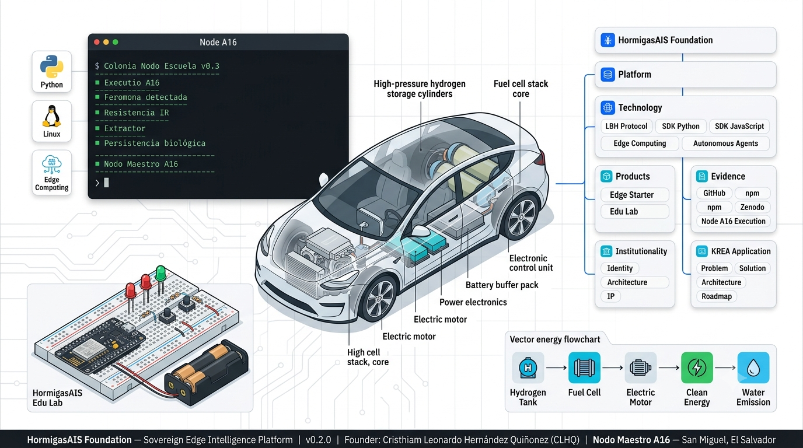

# 🏛 HormigasAIS Foundation

> Repositorio fundacional del ecosistema **HormigasAIS**.

> Plataforma soberana de agentes inteligentes Edge para educación, automatización e infraestructura distribuida.

---

# Visión

HormigasAIS es una plataforma tecnológica diseñada para desplegar inteligencia distribuida sobre dispositivos de bajo costo utilizando software libre, protocolos abiertos y arquitecturas Edge.

El ecosistema integra investigación, desarrollo de protocolos, SDKs, productos, evidencia técnica e institucionalidad en una única arquitectura coherente.

---

# Ecosistema

HormigasAIS
├── Plataforma ├── Tecnología │   ├── LBH Protocol │   ├── SDK Python │   └── SDK JavaScript │ ├── Productos │   ├── Edge Starter │   ├── Edu Lab │   └── LBH Protocol │ ├── Evidencia Técnica │   ├── GitHub │   ├── npm │   ├── Zenodo │   └── Nodo A16 │ └── Institucionalidad

---

# Componentes

## Plataforma

Describe la visión general del ecosistema.

→ `platform/`

---

## Tecnología

Contiene la arquitectura técnica del proyecto.

Incluye:

- Lenguaje Binario HormigasAIS (LBH)
- SDK Python
- SDK JavaScript
- Arquitectura Edge
- Agentes Autónomos

→ `technology/`

---

## Productos

El ecosistema actualmente se organiza alrededor de tres productos principales.

### HormigasAIS Edge Starter

Starter oficial para desplegar nodos soberanos con agentes LBH.

Dirigido a:

- empresas
- desarrolladores
- integradores
- automatización Edge

---

### HormigasAIS Edu Lab

Laboratorio educativo para escuelas, universidades y organizaciones.

Incluye:

- IA
- IoT
- ESP8266
- Python
- Sistemas Distribuidos
- Edge Computing

Costo aproximado del laboratorio:

- ESP8266 ≈ USD 2
- Kit educativo ≈ USD 7

---

### LBH Protocol

Capa tecnológica que define el protocolo de comunicación soberano del ecosistema HormigasAIS.

Incluye:

- especificación formal
- SDKs
- codificación binaria
- firmas
- validación

---

# Evidencia Técnica

Este repositorio concentra la evidencia pública del proyecto.

Incluye referencias a:

- repositorios GitHub
- paquetes npm
- DOI Zenodo
- documentación
- Nodo A16
- evidencia de ejecución

→ `evidence/`

---

# Institucionalidad

Documentación relacionada con:

- identidad tecnológica
- arquitectura institucional
- propiedad intelectual
- posicionamiento del ecosistema

→ `institutionality/`

---

# KREA Application

La carpeta `krea/` contiene la documentación preparada para procesos de aceleración, fondos de innovación y convocatorias institucionales.

Incluye:

- Problema
- Solución
- Arquitectura
- Evidencia técnica
- Mercado objetivo
- Modelo de negocio
- Roadmap
- Impacto social

---

# Repositorios relacionados

- Lenguaje Binario HormigasAIS
- lbh-sdk
- lbh-sdk-js
- hormigasais-edge-starter
- hormigasais-edu-lab
- HormigasAIS Institucionalidad

---

# Objetivo

Construir una plataforma soberana de inteligencia distribuida que permita desplegar agentes autónomos en dispositivos de bajo costo para educación, automatización e infraestructura Edge.

---

**Autor**

Cristhiam Leonardo Hernández Quiñonez (CLHQ)

Founder • HormigasAIS

Nodo Maestro A16 • San Miguel • El Salvador 🇸🇻

---

**Versión**

HormigasAIS Foundation

v0.2.0

## 📊 Evidence Locker — HormigasAIS Foundation

Tabla única de trazabilidad pública. Cada fila es un artefacto verificable de forma independiente.

| Componente | Tipo | Enlace / Referencia | Estado |
|---|---|---|---|
| hormigasais-site | Repo GitHub | `Thrumanshow/hormigasais-site` | ✅ Producción |
| hormigasais-worker | Repo GitHub | `HormigasAIS/hormigasais-worker` | ✅ Producción |
| hormigasais-docs | Repo GitHub | `Thrumanshow/hormigasais-docs` | ✅ Activo |
| HormigasAIS-Blog | Repo GitHub | `Thrumanshow/HormigasAIS-Blog` | ✅ Activo |
| HormigasAIS-Institucionalidad | Repo GitHub | `Thrumanshow/HormigasAIS-Institucionalidad` | ✅ Activo |
| LBH SDK (Python) | Paquete PyPI | *(https://pypi.org/project/lbh-sdk/)* | ✅ Publicado |
| LBH SDK (JavaScript) | Paquete npm | *(https://www.npmjs.com/package/lbh-sdk-hormigasais)* | ✅ Publicado |
| LBH_SPEC_v2.0 | Especificación + DOI | *(https://zenodo.org/records/19177759)* | ✅ Publicado |
| hormigasais-edge-starter | Producto comercial | *(https://www.npmjs.com/package/hormigasais-edge-starter)* | ✅ Publicado |
| blog.hormigasais.com | Sitio en producción | https://blog.hormigasais.com | ✅ Activo |
| Nodo A16 — Colonia Escuela v0.3 | Ejecución en vivo | `evidence/assets/architecture-overview-v0.2.0.png` | ✅ Verificado |
| Nodo A16 — Trampa de Mosquitos IoT | Hardware / Firmware | `evidence/hardware-mosquito-trap.md` | ✅ Verificado |

👉 [`evidence/README.md`](./evidence/README.md)

